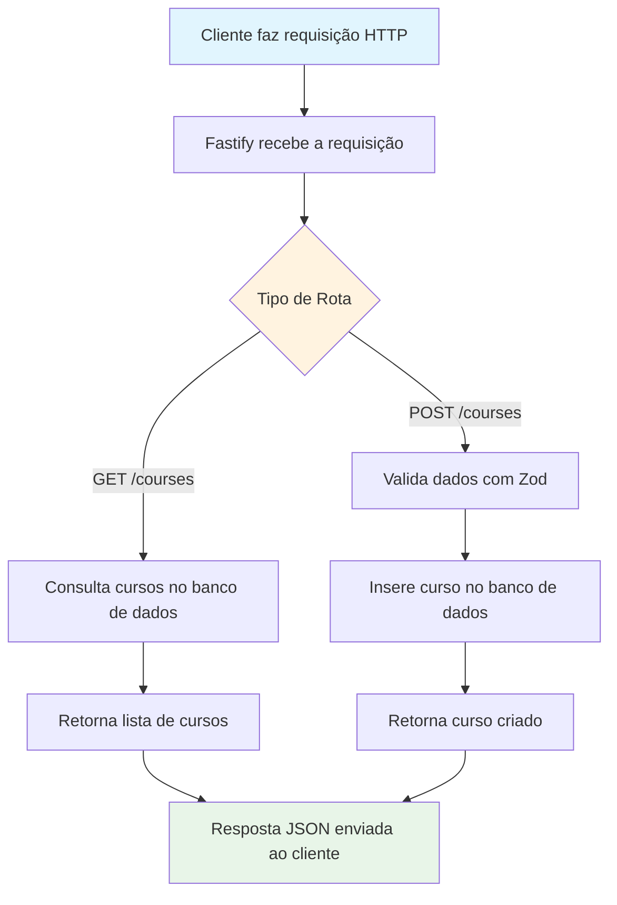

# API Node

Este projeto é uma API desenvolvida em Node.js utilizando TypeScript, Drizzle ORM e Docker para facilitar o desenvolvimento e a integração com banco de dados.

## Funcionalidades
- Estrutura modular com TypeScript
- Gerenciamento de banco de dados com Drizzle ORM
- Migrações versionadas em `drizzle/`
- Configuração de ambiente via Docker Compose

## Estrutura do Projeto
```
docker-compose.yml         # Configuração de containers Docker
package.json              # Dependências e scripts do Node.js
tsconfig.json              # Configuração do TypeScript
server.ts                 # Arquivo principal do servidor
src/database/             # Código relacionado ao banco de dados
  client.ts               # Cliente de conexão
  schema.ts               # Definição dos esquemas
```

## Como executar
1. Instale as dependências:
   ```bash
   npm install
   ```
2. Inicie os containers Docker:
   ```bash
   docker-compose up -d
   ```
3. Execute a aplicação:
   ```bash
   npm run dev
   ```

## Banco de Dados
As migrações estão localizadas na pasta `drizzle/`. O Drizzle ORM gerencia as alterações e snapshots do banco.

## Testes de Requisição
O arquivo `request.http` contém exemplos de requisições para testar os endpoints da API.

## Fluxo Principal da Aplicação

O diagrama abaixo representa o fluxo de criação e consulta de cursos na API:



## Contribuição
Sinta-se à vontade para abrir issues ou enviar pull requests.

## Licença
Este projeto está sob a licença MIT.
